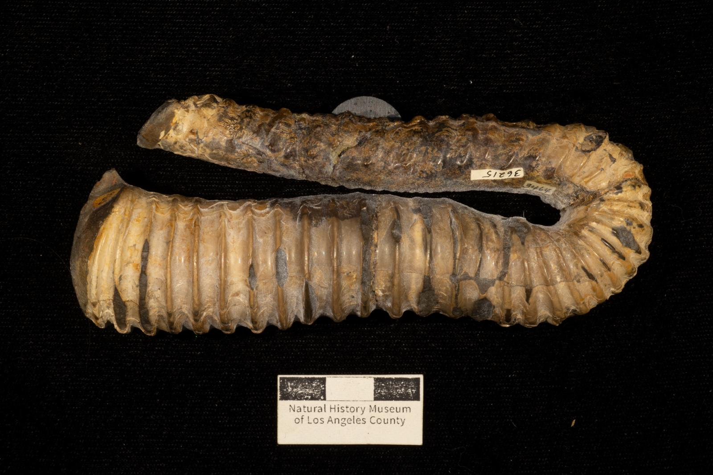

# Helicancylus pilsbryi (Anderson, 1938) - LACMIP 9951.3 - LACM Invertebrate Paleontology - 576cbe09-6484-4f87-b15d-b8a17c90a835	 https://www.gbif.org/occurrence/2012640793
[](https://doi.org/10.5281/zenodo.7114321) 

[](https://archive.softwareheritage.org/browse/origin/?origin_url=https://github.com/jhpoelen/LACMIP_9951-3_Helicancylus_pilsbryi.html)

[](data/3f/44/3f441786c6484fbdb484a15bec466f1218d39bb54767c19cc09987df949c0c19)

<a href="./data/4e/0f/4e0f93cb1fa122c25e853709b3d28ce9d9f898e9fb30c858eb5def0ae4bfc73e"></a> 

[hash://sha256/4e0f...](./data/4e/0f/4e0f93cb1fa122c25e853709b3d28ce9d9f898e9fb30c858eb5def0ae4bfc73e)

## 3D Model

[View 3D Model](https://jhpoelen.nl/LACMIP_9951-3_Helicancylus_pilsbryi/LACMIP_9951-3_Helicancylus_pilsbryi.html)

# References

Helicancylus pilsbryi (Anderson, 1938) - LACMIP 9951.3 - LACM Invertebrate Paleontology - 73e389aa-5886-4c48-8778-ba8932d1bd7e https://www.gbif.org/occurrence/2012640793

https://sketchfab.com/3d-models/lacmip-99513-hamiticeras-pilsbryi-e9ddba7c2cff454cbe67ebdceecba6e4

CATALOG #: LACMIP 9951.3; SCIENTIFIC NAME: Hamiticeras pilsbryi Anderson, 1938; HIGHER CLASSIFICATION: Animalia | Mollusca | Cephalopoda | Ammonoidea | Ancyloceratina | Ancyloceratidae | Hamiticeras; HIGHER GEOGRAPHY: North America | United States | California | Shasta County; AGE: Early Cretaceous: Aptian - Early Cretaceous: Aptian; FORMATION: Budden Canyon Formation

CREATOR: Lindsay Walker (NHMLA/LACMIP); DATE: 2018; MODALITY: NextEngine 3D Scanner; DEVICE FACILITY: Raymond Alf Museum of Paleontology; CITATION: LACMIP 9951.3 (Natural History Museum of Los Angeles County, Invertebrate Paleontology Collection); DATASET NAME: Cretaceous World TCN (NSF 1902262), Cretaceous Seas of California (NSF 1561429); occurrenceID: 576cbe09-6484-4f87-b15d-b8a17c90a835; collectionID: urn:uuid:3d086afe-1145-4aaf-a0c1-aab5d83a8c38; institutionID: urn:lsid:biocol.org:col:34802
...

## 

# Appendix A
## Provenance

```
$ preston history
```

```
<hash://sha256/4e0f93cb1fa122c25e853709b3d28ce9d9f898e9fb30c858eb5def0ae4bfc73e> <http://www.w3.org/ns/prov#wasDerivedFrom> <hash://sha256/8ad31345ca327f903fe3c6a6df73847635bb82b224977794ce8c76ef483eb96e> .
<hash://sha256/8ad31345ca327f903fe3c6a6df73847635bb82b224977794ce8c76ef483eb96e> <http://www.w3.org/ns/prov#wasDerivedFrom> <hash://sha256/134e3c2d8978baaa003e8990b442b21a7bb47e9413b86cde11dbe49b5a31504c> .
<hash://sha256/134e3c2d8978baaa003e8990b442b21a7bb47e9413b86cde11dbe49b5a31504c> <http://www.w3.org/ns/prov#wasDerivedFrom> <hash://sha256/ead72d5f9e65313563da7e3ec7700ff671d77c104323e0d11ce2444eae372b63> .
<hash://sha256/ead72d5f9e65313563da7e3ec7700ff671d77c104323e0d11ce2444eae372b63> <http://www.w3.org/ns/prov#wasDerivedFrom> <hash://sha256/6c8ed9f9f025144e50775eeacbf4274e25bd8f635f61967f2b5761220168fec4> .
<hash://sha256/6c8ed9f9f025144e50775eeacbf4274e25bd8f635f61967f2b5761220168fec4> <http://www.w3.org/ns/prov#wasDerivedFrom> <hash://sha256/3f2005426df734fe242a5b991d4fcb1752eebda005e2d1998e3711469f95ea9e> .
<hash://sha256/3f2005426df734fe242a5b991d4fcb1752eebda005e2d1998e3711469f95ea9e> <http://www.w3.org/ns/prov#wasDerivedFrom> <hash://sha256/d1a1d4745965e3d9427387c7e3cd2556aec37cd0d76dd8e900cd2ce28d882871> .
<hash://sha256/d1a1d4745965e3d9427387c7e3cd2556aec37cd0d76dd8e900cd2ce28d882871> <http://www.w3.org/ns/prov#wasDerivedFrom> <hash://sha256/ad85a504594151e2c2617ada471fda4d785a2f8be686b49708876f1624956ecb> .
<hash://sha256/ad85a504594151e2c2617ada471fda4d785a2f8be686b49708876f1624956ecb> <http://www.w3.org/ns/prov#wasDerivedFrom> <hash://sha256/d233af3699e8937aff1d8677676593d500656549cc314ca95a34e4c71623eee1> .
<hash://sha256/d233af3699e8937aff1d8677676593d500656549cc314ca95a34e4c71623eee1> <http://www.w3.org/ns/prov#wasDerivedFrom> <hash://sha256/d5a3f1f3d3d1f83c4a885e757dcc9035785101844ba2b60aa4f6670c9d82b248> .
<urn:uuid:0659a54f-b713-4f86-a917-5be166a14110> <http://purl.org/pav/hasVersion> <hash://sha256/d5a3f1f3d3d1f83c4a885e757dcc9035785101844ba2b60aa4f6670c9d82b248> .
```


# Appendix B
## Tracked Content 

```
preston alias
```

```
<file:///media/jorrit/brit/LACMIP-9951.3/LACMIP_9951-3_Helicancylus_pilsbryi.zip> <http://purl.org/pav/hasVersion> <hash://sha256/beb015cdac8f13a5750ed3814810ceb225ab2af7b62f7796ffa0261ae39aa51f> <urn:uuid:006f7686-31c5-4421-9e53-15052580f648> .
<http://digitalgallery.nhm.org:8085/invertpaleo_nhm/api/v1/asset/747546/preview> <http://purl.org/pav/hasVersion> <hash://sha256/3f441786c6484fbdb484a15bec466f1218d39bb54767c19cc09987df949c0c19> <urn:uuid:9d4e215c-86c5-4214-8f7a-25b061df9584> .
<http://digitalgallery.nhm.org:8085/invertpaleo_nhm/api/v1/asset/747546/_original> <http://purl.org/pav/hasVersion> <hash://sha256/c1e61bd9dfc1f044602bb7875b04a6a5e1e7c38e2e7af53adf96c4f4155dfe08> <urn:uuid:66d5ee23-683d-4660-9b6c-9b976d7973ce> .
<http://digitalgallery.nhm.org:8085/invertpaleo_nhm/api/v1/asset/702003/preview> <http://purl.org/pav/hasVersion> <hash://sha256/9f223f7209365495a39be7a30b1b3dcf121e65fd165bc7b46f28a00985cf4760> <urn:uuid:5e25e215-12ed-4e23-8ef2-55bc53399afc> .
<http://digitalgallery.nhm.org:8085/invertpaleo_nhm/api/v1/asset/702003/_original> <http://purl.org/pav/hasVersion> <hash://sha256/ba4fa664a6dc7324fba8eec07e34ac34bdd3bce3a60b276ea267e942b933979a> <urn:uuid:5fea8e45-94e7-4e33-a943-0588672862b5> .
<http://digitalgallery.nhm.org:8085/invertpaleo_nhm/api/v1/asset/747546/preview> <http://purl.org/pav/hasVersion> <hash://sha256/3f441786c6484fbdb484a15bec466f1218d39bb54767c19cc09987df949c0c19> <urn:uuid:a91a44b8-ef10-4474-b3ee-44a276855e6f> .
<http://digitalgallery.nhm.org:8085/invertpaleo_nhm/api/v1/asset/747546/_original> <http://purl.org/pav/hasVersion> <hash://sha256/c1e61bd9dfc1f044602bb7875b04a6a5e1e7c38e2e7af53adf96c4f4155dfe08> <urn:uuid:368575c9-413a-443d-a116-420e1795be6d> .
<http://digitalgallery.nhm.org:8085/invertpaleo_nhm/api/v1/asset/702003/preview> <http://purl.org/pav/hasVersion> <hash://sha256/9f223f7209365495a39be7a30b1b3dcf121e65fd165bc7b46f28a00985cf4760> <urn:uuid:2559cdc6-a638-4401-a206-1c8debe2e63c> .
<http://digitalgallery.nhm.org:8085/invertpaleo_nhm/api/v1/asset/702003/_original> <http://purl.org/pav/hasVersion> <hash://sha256/ba4fa664a6dc7324fba8eec07e34ac34bdd3bce3a60b276ea267e942b933979a> <urn:uuid:59ae7233-551c-4ef5-806d-bef15f6571ea> .
<http://digitalgallery.nhm.org:8085/invertpaleo_nhm/api/v1/asset/736692/preview> <http://purl.org/pav/hasVersion> <hash://sha256/099bcdc0db8ed1a7ca25993d9a8576524ab819e732096967a52fbbe2b5827d62> <urn:uuid:f6ed3c3e-c9d5-4b2d-b22f-7899ae82b242> .
<http://digitalgallery.nhm.org:8085/invertpaleo_nhm/api/v1/asset/646140/preview> <http://purl.org/pav/hasVersion> <hash://sha256/049583c4b8037618cc279a846f1b59310971d88fae20bc315dfba7703bc37c4f> <urn:uuid:64714b4d-520e-4240-b3b0-952e7d5267bd> .
<http://digitalgallery.nhm.org:8085/invertpaleo_nhm/api/v1/asset/646142/preview> <http://purl.org/pav/hasVersion> <hash://sha256/f14316ca1ab92962b01aba5c18fb66bd814d6a3ac1d31f2ca6492408ed77002c> <urn:uuid:f966b8cf-985d-4dc8-bf39-e39a5be297a6> .
<http://digitalgallery.nhm.org:8085/invertpaleo_nhm/api/v1/asset/646143/preview> <http://purl.org/pav/hasVersion> <hash://sha256/e1f78aa91390bc087060c5f6c8d73bcac8b8509205c8bc7c171d207ee8e64813> <urn:uuid:b4606232-cb7a-46ad-a4cd-8195083a2fa7> .
<http://digitalgallery.nhm.org:8085/invertpaleo_nhm/api/v1/asset/646145/preview> <http://purl.org/pav/hasVersion> <hash://sha256/93cbd5c10cafb0ad0a12a4dc637bbd798fa4fcf37e6e91b48e99236b6043f12c> <urn:uuid:2e1c5032-2e5d-413e-a1b6-47d73f83494c> .
<http://digitalgallery.nhm.org:8085/invertpaleo_nhm/api/v1/asset/736718/preview> <http://purl.org/pav/hasVersion> <hash://sha256/52196d41385b9ffe9db7e0c73641586e20866f63f474f5f512748c32df9c1a62> <urn:uuid:175e5525-6806-46b7-b335-076386421366> .
<http://digitalgallery.nhm.org:8085/invertpaleo_nhm/api/v1/asset/646146/preview> <http://purl.org/pav/hasVersion> <hash://sha256/5c17447184dc27b4a04c35179e62114da7ee4eb8e01df4d03f8779d9df628917> <urn:uuid:b9fbbea6-2788-4fd2-9e6d-ca58f227577d> .
<http://digitalgallery.nhm.org:8085/invertpaleo_nhm/api/v1/asset/736693/preview> <http://purl.org/pav/hasVersion> <hash://sha256/7f76dec97b1d4bf0d801c854c3944642445d98607f762cb5f758f68c92835f36> <urn:uuid:376b47a8-d101-4685-ba1c-948face24a7e> .
<http://digitalgallery.nhm.org:8085/invertpaleo_nhm/api/v1/asset/699016/preview> <http://purl.org/pav/hasVersion> <hash://sha256/b6ba135c66f874ac3cd269957eae8bc1486a7b5164da21dd064454340240d73a> <urn:uuid:0b187bca-c0d8-4e14-bf12-ae53c64c2331> .
<http://digitalgallery.nhm.org:8085/invertpaleo_nhm/api/v1/asset/646125/preview> <http://purl.org/pav/hasVersion> <hash://sha256/718b9beb80b52ac46e3735c6d2c9e0eb6398567c77bb79d76da49c58c5a6967f> <urn:uuid:fc53d0f8-4580-4d1b-b8d1-a8e52c1565e4> .
<http://digitalgallery.nhm.org:8085/invertpaleo_nhm/api/v1/asset/736398/preview> <http://purl.org/pav/hasVersion> <hash://sha256/a05db5b9e54a9994ba05e71a408a6b794c34871ca63aded05bdff64ef85dd5c7> <urn:uuid:a4e6443e-90a9-47e9-a05a-f89f96d0d179> .
<http://digitalgallery.nhm.org:8085/invertpaleo_nhm/api/v1/asset/753015/preview> <http://purl.org/pav/hasVersion> <hash://sha256/c6c3fc4b4412cd5a90b003a28e6e4cb5b0d64141fcca8e8b6340e3993a8aae17> <urn:uuid:7668aaec-62f7-41ea-9659-6ab7cfade907> .
<http://digitalgallery.nhm.org:8085/invertpaleo_nhm/api/v1/asset/736403/preview> <http://purl.org/pav/hasVersion> <hash://sha256/d60c898c63b245f1beb54d773ed2891964c6b70d4f673ac0ccbb619d5ef0bcd9> <urn:uuid:ecdc4995-4a6b-42a4-8502-4de3d1d21b4e> .
<http://digitalgallery.nhm.org:8085/invertpaleo_nhm/api/v1/asset/698901/preview> <http://purl.org/pav/hasVersion> <hash://sha256/f42f9404f43bb703f2eb95781c2dcbc48b284b015fa4d82b7b37b35c8365199d> <urn:uuid:9729166d-7843-4b16-b9a4-2d5abcb2ec6f> .
<http://digitalgallery.nhm.org:8085/invertpaleo_nhm/api/v1/asset/736407/preview> <http://purl.org/pav/hasVersion> <hash://sha256/6937cc753bc92aa10aa22097aa6acc64454f2df5767dccf46d747280dab3d5c8> <urn:uuid:a2350711-789a-4d84-be0c-8a70938b3031> .
<http://digitalgallery.nhm.org:8085/invertpaleo_nhm/api/v1/asset/698905/preview> <http://purl.org/pav/hasVersion> <hash://sha256/53b84264befcdfc113a1a6b258520087fabfa445e27f9d515757763114b3d43f> <urn:uuid:83128e00-54fa-443b-b65d-7ca8868b5e1f> .
<http://digitalgallery.nhm.org:8085/invertpaleo_nhm/api/v1/asset/736415/preview> <http://purl.org/pav/hasVersion> <hash://sha256/d4cfe541183264c41c285878a7cdc8cc04c30b390a3119a11f1d7e9b0a034539> <urn:uuid:59667619-1765-448e-96fc-9c2544c7403c> .
<http://digitalgallery.nhm.org:8085/invertpaleo_nhm/api/v1/asset/736424/preview> <http://purl.org/pav/hasVersion> <hash://sha256/acd50f7af7ae6027f2fcd9b162bc550f6ed477f49ef02e50b95d99357a727fc9> <urn:uuid:42642e58-e641-4702-8237-6e214d380f87> .
<http://digitalgallery.nhm.org:8085/invertpaleo_nhm/api/v1/asset/698908/preview> <http://purl.org/pav/hasVersion> <hash://sha256/5fc75d8d36fa453913fd6b640fe357d41df8b6cca35941d0cf111f218f85d5c4> <urn:uuid:2c565cb0-96ed-47d5-a3f1-363799d8d086> .
<http://digitalgallery.nhm.org:8085/invertpaleo_nhm/api/v1/asset/736649/preview> <http://purl.org/pav/hasVersion> <hash://sha256/bc30290605f4aa8e0497ac41126385fe221b73f0d9e7991618bc5154e6fb1a0a> <urn:uuid:81d104fb-7291-479b-bbca-f8ce7231d922> .
<http://digitalgallery.nhm.org:8085/invertpaleo_nhm/api/v1/asset/736652/preview> <http://purl.org/pav/hasVersion> <hash://sha256/9b1f95b20367c8f8c4cb9e9e7451e624d5a8208849ff49e0d8b7173752074f1d> <urn:uuid:8f0ccc49-dc59-43e9-980e-6771ea992b81> .
<http://digitalgallery.nhm.org:8085/invertpaleo_nhm/api/v1/asset/699003/preview> <http://purl.org/pav/hasVersion> <hash://sha256/c2377ff19a2ba6356b62c6c285d1d4194851a4834bd5c8ae9b6fd35cc94100a5> <urn:uuid:39d00f6c-f480-45dd-a630-efa56c2dbb5b> .
<http://digitalgallery.nhm.org:8085/invertpaleo_nhm/api/v1/asset/699004/preview> <http://purl.org/pav/hasVersion> <hash://sha256/2cc699ea341d07ae6f0c1616dded2c5b3c8070ce32fe3c1d3d4cd2cca6b432f0> <urn:uuid:fb96805f-82cf-4fdf-ae8c-159f2a1c35d8> .
<http://digitalgallery.nhm.org:8085/invertpaleo_nhm/api/v1/asset/736655/preview> <http://purl.org/pav/hasVersion> <hash://sha256/c20ddbaf835f6a72be15da38b3b0ec86497715cc7f502747c0b20c2deb279bef> <urn:uuid:8755a150-39b5-4541-8c32-fa51eebfb1fb> .
<http://digitalgallery.nhm.org:8085/invertpaleo_nhm/api/v1/asset/736659/preview> <http://purl.org/pav/hasVersion> <hash://sha256/fdfd1b75cbb4675a55ad735d6cb7476fa4ba602462abfe91fb2b7e8acf084d9e> <urn:uuid:170f82ad-f848-4385-b692-413b0e36264d> .
<http://digitalgallery.nhm.org:8085/invertpaleo_nhm/api/v1/asset/699009/preview> <http://purl.org/pav/hasVersion> <hash://sha256/ae532b1ea514552f16ef659f4841087c39b83499f0f7e0d78c959936d649073f> <urn:uuid:747d135c-635b-4239-ab0e-12122d249b48> .
<http://digitalgallery.nhm.org:8085/invertpaleo_nhm/api/v1/asset/736664/preview> <http://purl.org/pav/hasVersion> <hash://sha256/8c9d2b5241cf5a21dc7172452de2db3cdeb5f9b2b75970550394d4c10189ef52> <urn:uuid:b2ae6d3e-2f40-4ce0-9dd7-3e758d359d2f> .
<http://digitalgallery.nhm.org:8085/invertpaleo_nhm/api/v1/asset/753053/preview> <http://purl.org/pav/hasVersion> <hash://sha256/1ae5a843b21a9be314ee2d13b883297c4153d5021b7c35e558dbf9615b91794a> <urn:uuid:61daf765-0c30-43ca-afbd-7a0b0df2f0e0> .
<http://digitalgallery.nhm.org:8085/invertpaleo_nhm/api/v1/asset/736670/preview> <http://purl.org/pav/hasVersion> <hash://sha256/c837e13ceb2ed3f94b867c3b87cb7edbe1dd4815f49781fe1960668da8782deb> <urn:uuid:053cd415-0b49-41f4-8ffa-696dc6fd5819> .
<http://digitalgallery.nhm.org:8085/invertpaleo_nhm/api/v1/asset/736683/preview> <http://purl.org/pav/hasVersion> <hash://sha256/b5767f3f35dcc0c55bfb1c8b2b4c1a511b817e9961ea4e8915a563bbd845f81b> <urn:uuid:ef29fb0f-6814-4c7b-b14c-9c41eeda5d1e> .
<http://digitalgallery.nhm.org:8085/invertpaleo_nhm/api/v1/asset/646137/preview> <http://purl.org/pav/hasVersion> <hash://sha256/509c477dc78d84ba07b19089a4975b06cbfd3bed8d06c207f665e79905d94eaf> <urn:uuid:00982371-6c9e-4b64-bd9a-a4e0624a213d> .
<http://digitalgallery.nhm.org:8085/invertpaleo_nhm/api/v1/asset/736685/preview> <http://purl.org/pav/hasVersion> <hash://sha256/7e97fa78b348373f2b4397bc369bac6fefcc9060a9efb582e6856ab1982827ab> <urn:uuid:f5916cfa-8f39-4fd8-98ee-d0a22cc13104> .
<http://digitalgallery.nhm.org:8085/invertpaleo_nhm/api/v1/asset/736687/preview> <http://purl.org/pav/hasVersion> <hash://sha256/036e4c720983d8ae2c82c22982e918db744608e25d18cc9ea6ebb26dc747f3dc> <urn:uuid:1f98bbd4-9a93-48c0-b15a-e863812991de> .
<http://digitalgallery.nhm.org:8085/invertpaleo_nhm/api/v1/asset/736690/preview> <http://purl.org/pav/hasVersion> <hash://sha256/1e131797fa803d2de55592e0e4c88be3e2da5dea494d898b832322947e386d5d> <urn:uuid:0b242884-ac66-444b-881a-87a74d8dc9ed> .
<http://digitalgallery.nhm.org:8085/invertpaleo_nhm/api/v1/asset/698874/preview> <http://purl.org/pav/hasVersion> <hash://sha256/5381de45578b13648381923818a232367c3e51fc0ab00b964ceaf77a9d088453> <urn:uuid:01cef35e-c174-4633-bea9-85e7a1ca7fcc> .
<http://digitalgallery.nhm.org:8085/invertpaleo_nhm/api/v1/asset/753001/preview> <http://purl.org/pav/hasVersion> <hash://sha256/853d872208c310b8184b52ef336ac61eeac3931fb5aace4de953410f994da60b> <urn:uuid:9ee87a2b-664c-492d-93a5-945d9db36370> .
<http://digitalgallery.nhm.org:8085/invertpaleo_nhm/api/v1/asset/736303/preview> <http://purl.org/pav/hasVersion> <hash://sha256/d70562711b0513d7939de7737824f1d71f4732fa20708018151411f1ab85a786> <urn:uuid:cd72ccb1-3521-4045-83cb-c2adcb7af13d> .
<http://digitalgallery.nhm.org:8085/invertpaleo_nhm/api/v1/asset/736308/preview> <http://purl.org/pav/hasVersion> <hash://sha256/71fbbf75dfb14936bda6960a7e495781e5800562d58a510810ccaba159366723> <urn:uuid:ea9cbec0-d974-4bb4-9140-db376a33f319> .
<http://digitalgallery.nhm.org:8085/invertpaleo_nhm/api/v1/asset/736314/preview> <http://purl.org/pav/hasVersion> <hash://sha256/c96e50848fc67846c1888b852dae8999c1a2bc58bc3c9ea99d581cbc47a95ae3> <urn:uuid:710d3c44-da33-463f-830a-6123368f1424> .
<http://digitalgallery.nhm.org:8085/invertpaleo_nhm/api/v1/asset/736321/preview> <http://purl.org/pav/hasVersion> <hash://sha256/b4f181c32db8a045bb4dabf463ccc3b0e827fd243b18b8581e69833045de46f8> <urn:uuid:0d0c951a-b170-44d6-9ffe-ca17f3df7c52> .
<http://digitalgallery.nhm.org:8085/invertpaleo_nhm/api/v1/asset/698878/preview> <http://purl.org/pav/hasVersion> <hash://sha256/195257e63264bfc6b40fbdbb241f228af43cdaa457c91a15e6c4f38f4b445ac2> <urn:uuid:1fc22f4d-92a0-425e-aeec-63d95d5713c0> .
<http://digitalgallery.nhm.org:8085/invertpaleo_nhm/api/v1/asset/736328/preview> <http://purl.org/pav/hasVersion> <hash://sha256/c4cbbb9287aa957e04354f55bb1333010448b184fcf4a86c0db4654c7d682214> <urn:uuid:f647036a-213c-4a03-9f49-0562bba0bef5> .
<http://digitalgallery.nhm.org:8085/invertpaleo_nhm/api/v1/asset/736334/preview> <http://purl.org/pav/hasVersion> <hash://sha256/8a2f45f8fd4120fd4681c69d20b3b4239388e6e913f6634ea41756858a2479df> <urn:uuid:ef5c54ba-c622-45a1-950c-55c1aaf09715> .
<http://digitalgallery.nhm.org:8085/invertpaleo_nhm/api/v1/asset/698882/preview> <http://purl.org/pav/hasVersion> <hash://sha256/ececfa8195d76a4a9f0e265c3befa6bce862667748903ed8dc2252f4f53b97f1> <urn:uuid:e130d528-02b5-475f-ac49-a44eb51af39e> .
<http://digitalgallery.nhm.org:8085/invertpaleo_nhm/api/v1/asset/736343/preview> <http://purl.org/pav/hasVersion> <hash://sha256/e48ecdcb4743f086fb80168c6018c3ab28d717bb0621a93efd1644527dfed3db> <urn:uuid:b3b5000f-d76f-41c0-a8ea-5b1d981dedb8> .
<http://digitalgallery.nhm.org:8085/invertpaleo_nhm/api/v1/asset/736349/preview> <http://purl.org/pav/hasVersion> <hash://sha256/321f7579238be8afa19536c0da3f695969c983992a3a40a223af7bc851fa8008> <urn:uuid:8be18bb5-4d88-46b5-98f8-e3fffe5ea197> .
<http://digitalgallery.nhm.org:8085/invertpaleo_nhm/api/v1/asset/736355/preview> <http://purl.org/pav/hasVersion> <hash://sha256/79d97052b9f77618c55944a35234c962e74a9e0cd6e4dab58ecf3e5d8e0f1620> <urn:uuid:d25de185-4117-4419-8d3e-e8afa046433e> .
<http://digitalgallery.nhm.org:8085/invertpaleo_nhm/api/v1/asset/698886/preview> <http://purl.org/pav/hasVersion> <hash://sha256/2aa9eea2e301155cc60e74597629a33839c2a84651abcd51f45aa9c601913044> <urn:uuid:12650ddb-dfad-4739-a4d1-2f79f73f53b4> .
<http://digitalgallery.nhm.org:8085/invertpaleo_nhm/api/v1/asset/698887/preview> <http://purl.org/pav/hasVersion> <hash://sha256/58ba62367809356cd54f2a765ec3de2644e1c90fe14e98b467cec512f2732ef8> <urn:uuid:34930bec-1785-4fe4-a0a9-81335c9cbcc1> .
<http://digitalgallery.nhm.org:8085/invertpaleo_nhm/api/v1/asset/698890/preview> <http://purl.org/pav/hasVersion> <hash://sha256/f3e74bda4b7feae4bfb67ea83fd355c44d336c97ab25d01ebc4977b343940f08> <urn:uuid:ee539544-cdc9-4823-aaf8-2bde36c9d70f> .
<http://digitalgallery.nhm.org:8085/invertpaleo_nhm/api/v1/asset/736361/preview> <http://purl.org/pav/hasVersion> <hash://sha256/86781b41668e2649c0ec37f328c97a72be44cd71add2672408f2ea1a2959f167> <urn:uuid:e73e7963-6d81-4092-a45a-557ed1e25c1f> .
<http://digitalgallery.nhm.org:8085/invertpaleo_nhm/api/v1/asset/698892/preview> <http://purl.org/pav/hasVersion> <hash://sha256/0aaa163d8c8793710c61f06805d91b23a1d005b7a2787051ebc4d0cfff3eb084> <urn:uuid:60b7a45f-df79-41f0-ac64-03ac9c5d85c2> .
<http://digitalgallery.nhm.org:8085/invertpaleo_nhm/api/v1/asset/736367/preview> <http://purl.org/pav/hasVersion> <hash://sha256/1dd0772c4254c48e056da455f670b7f9256cd0e79926bd3cb7fa071a4948314a> <urn:uuid:4f0548bc-2cc8-4144-a687-f620aeccddab> .
<http://digitalgallery.nhm.org:8085/invertpaleo_nhm/api/v1/asset/698894/preview> <http://purl.org/pav/hasVersion> <hash://sha256/5ec7d333e0b72c12e3ad1b15101957faa2d763ff0de7c5783035bed9be146520> <urn:uuid:c51c5860-56a0-4b38-bb97-f964cd5d1ee6> .
<http://digitalgallery.nhm.org:8085/invertpaleo_nhm/api/v1/asset/698895/preview> <http://purl.org/pav/hasVersion> <hash://sha256/009d54a6509cbf5eb8168d23edaaa6c05a5ea9bd156c78869414b2356292fb1c> <urn:uuid:3a6ebc2a-ccc2-465f-8ef5-1cba9e268c9c> .
<http://digitalgallery.nhm.org:8085/invertpaleo_nhm/api/v1/asset/736373/preview> <http://purl.org/pav/hasVersion> <hash://sha256/3bb78e271cee677216898c4bc5ed9827965b07441c1214107c5a3bad086230ec> <urn:uuid:36ef52ef-e30e-49cb-8483-b74952e4bb7c> .
<http://digitalgallery.nhm.org:8085/invertpaleo_nhm/api/v1/asset/736383/preview> <http://purl.org/pav/hasVersion> <hash://sha256/406dec8fe6f2001fc959986e05c7bc86ff422dda86847ee65ffe43499e705e21> <urn:uuid:20faea86-6781-4284-a4ed-e121aa2cac40> .
<http://digitalgallery.nhm.org:8085/invertpaleo_nhm/api/v1/asset/736390/preview> <http://purl.org/pav/hasVersion> <hash://sha256/d9f0d91e1d0df507842989c4e0a0ace13aff6bbd6d004c204088f9ddf08a679d> <urn:uuid:d60a61af-c7be-412c-aa5b-765b54b17866> .
<http://digitalgallery.nhm.org:8085/invertpaleo_nhm/api/v1/asset/736393/preview> <http://purl.org/pav/hasVersion> <hash://sha256/22471dbb58bd37405272b732d2b0e5cb3f32d59546e1667b9ef69e23ffb99c07> <urn:uuid:9b0b77ba-5bb0-433f-b807-82dd98f5146d> .
<http://digitalgallery.nhm.org:8085/invertpaleo_nhm/api/v1/asset/736201/preview> <http://purl.org/pav/hasVersion> <hash://sha256/6f5115f82d0798e330452c002e25be5ecb2f3b38d67953e0e7e52e4766edf498> <urn:uuid:8594e8e5-afe7-4c03-b247-56a864406a45> .
<http://digitalgallery.nhm.org:8085/invertpaleo_nhm/api/v1/asset/647087/preview> <http://purl.org/pav/hasVersion> <hash://sha256/cad9a0918fdad96e6640282152439ecb07db5a7956824fe9de141d6623458f70> <urn:uuid:ed38e389-fcb4-4dec-af60-21b9cb2dd4ab> .
<http://digitalgallery.nhm.org:8085/invertpaleo_nhm/api/v1/asset/736209/preview> <http://purl.org/pav/hasVersion> <hash://sha256/03e74a3417241fb1f1932db6d3120dc94212f6b6a190f5a5ece57464c07e5033> <urn:uuid:e6c1a4c0-b8b5-4dbb-acad-2d975eced08b> .
<http://digitalgallery.nhm.org:8085/invertpaleo_nhm/api/v1/asset/736212/preview> <http://purl.org/pav/hasVersion> <hash://sha256/c5d6b6ad993005967dfa579b859e2ac4a4b7134cf1fe4f3f0b2e7c1aef2afed3> <urn:uuid:386952eb-6d22-4a7d-96d8-a98dbe378c1d> .
<http://digitalgallery.nhm.org:8085/invertpaleo_nhm/api/v1/asset/736217/preview> <http://purl.org/pav/hasVersion> <hash://sha256/379330687debadfa23742f3bf52811a046fedb7821efac9f0517f5c6c6c8370d> <urn:uuid:4ab9c457-e543-496c-b5d2-970fbff10cbc> .
<http://digitalgallery.nhm.org:8085/invertpaleo_nhm/api/v1/asset/736219/preview> <http://purl.org/pav/hasVersion> <hash://sha256/10cc15f2fabea466b83103faaf24c15b9f4e3973110a20cc57b0c71357a14234> <urn:uuid:13ce603b-bb64-48c2-a73a-c487282810db> .
<http://digitalgallery.nhm.org:8085/invertpaleo_nhm/api/v1/asset/736224/preview> <http://purl.org/pav/hasVersion> <hash://sha256/348830b3796bf40acf4317abbc763b381dfdf1c92a905cf0334f8763772a9877> <urn:uuid:10aa0eea-f7f2-44bb-b4b7-531ee52ad483> .
<http://digitalgallery.nhm.org:8085/invertpaleo_nhm/api/v1/asset/736229/preview> <http://purl.org/pav/hasVersion> <hash://sha256/5343cf55533def005b4759ac03cf4094c33fb507918154c1ad341b2438646718> <urn:uuid:d306aee4-9fb8-477e-99a8-6a2987724848> .
<http://digitalgallery.nhm.org:8085/invertpaleo_nhm/api/v1/asset/645920/preview> <http://purl.org/pav/hasVersion> <hash://sha256/bc885d564a54b95efc797e8a0dc1ffc089193970e6042fe319d58c748d5eab0d> <urn:uuid:e96c215e-1f32-49c9-a5c6-833304d20386> .
<http://digitalgallery.nhm.org:8085/invertpaleo_nhm/api/v1/asset/752991/preview> <http://purl.org/pav/hasVersion> <hash://sha256/8b42a7771209b17e6a50bf307d95eb937fb3b035d7cdb3d0f3259a5122ea2934> <urn:uuid:aa19887e-c199-43c6-962e-88726377f9f0> .
<http://digitalgallery.nhm.org:8085/invertpaleo_nhm/api/v1/asset/736234/preview> <http://purl.org/pav/hasVersion> <hash://sha256/690831a60d418885535febf7d995e0dac7b035b943b7d8732da9fe6316da2a2a> <urn:uuid:a3b5df0d-4f7a-40db-baa7-00142ac48fc3> .
<http://digitalgallery.nhm.org:8085/invertpaleo_nhm/api/v1/asset/736240/preview> <http://purl.org/pav/hasVersion> <hash://sha256/7939b0af82a980340b2b63d22d6ee49ada91298335d552cdd86e20a811a7f1d7> <urn:uuid:ecc4f8eb-51ac-4308-b3c1-4fed37c600ec> .
<http://digitalgallery.nhm.org:8085/invertpaleo_nhm/api/v1/asset/646116/preview> <http://purl.org/pav/hasVersion> <hash://sha256/eb9cf557a159367771f34c2709a96d0c0c73aaf56c9c49892004a9c523561e0a> <urn:uuid:5d6e1863-eeef-46aa-b16a-0d45e3c9398e> .
<http://digitalgallery.nhm.org:8085/invertpaleo_nhm/api/v1/asset/646117/preview> <http://purl.org/pav/hasVersion> <hash://sha256/d316044f63122af7729b31c595c3af091c4fa6c2845dbf01c054ced85f6a3655> <urn:uuid:c9443fd1-46a4-4a30-b271-1b4872b6b6f3> .
<http://digitalgallery.nhm.org:8085/invertpaleo_nhm/api/v1/asset/698866/preview> <http://purl.org/pav/hasVersion> <hash://sha256/c6964c515527f5fb702ff74a8713ef97e8b4034a9377d6a670bc2c7761caec74> <urn:uuid:1800cecf-dad6-48c8-80ce-bf50136be4a2> .
<http://digitalgallery.nhm.org:8085/invertpaleo_nhm/api/v1/asset/736245/preview> <http://purl.org/pav/hasVersion> <hash://sha256/2e3e5d9018ed50ec610099716aed066da40ab243155155f546e60f26aa000a32> <urn:uuid:ae74aa84-3271-4feb-b398-d411508d9921> .
<http://digitalgallery.nhm.org:8085/invertpaleo_nhm/api/v1/asset/645924/preview> <http://purl.org/pav/hasVersion> <hash://sha256/c8e14cef91e809fa532d3d56bb396cbb7ca5e1dc2c9e630ac856332e2947c70c> <urn:uuid:0c39aa19-a846-4bb4-8b40-0a69c9b07409> .
<http://digitalgallery.nhm.org:8085/invertpaleo_nhm/api/v1/asset/736249/preview> <http://purl.org/pav/hasVersion> <hash://sha256/2d67a85dc88b7888b3afa05e4d2f51ffd00350e40665e89a152d8a913496ef23> <urn:uuid:7cf9d533-3a8e-4292-863d-b1cd950d39ee> .
<http://digitalgallery.nhm.org:8085/invertpaleo_nhm/api/v1/asset/736255/preview> <http://purl.org/pav/hasVersion> <hash://sha256/70e61a2e74d14ce4a52ebc739d293647574b319b271cef85ea930c4adb85ca23> <urn:uuid:a821578d-20cc-4e6e-a2e8-d3fc3f834517> .
<http://digitalgallery.nhm.org:8085/invertpaleo_nhm/api/v1/asset/736261/preview> <http://purl.org/pav/hasVersion> <hash://sha256/f33f2bcaf45b5db80ee123e50ccab52b785f3b60b05beb980e4242d4e49a3bdc> <urn:uuid:47fc3cac-0bb0-4899-a75e-da2202e2e724> .
<http://digitalgallery.nhm.org:8085/invertpaleo_nhm/api/v1/asset/736268/preview> <http://purl.org/pav/hasVersion> <hash://sha256/2f3fbc96a2e25d85e4e1d1c8c1f0c0920baa74c7fa38f996b6a3ad98f358ad60> <urn:uuid:4ca03c30-f905-4bab-a89c-bbe1e8fb9157> .
<http://digitalgallery.nhm.org:8085/invertpaleo_nhm/api/v1/asset/736273/preview> <http://purl.org/pav/hasVersion> <hash://sha256/8c5961356af08cdfe89e550b48a79460676162aabbd20e9c8e14b852ee9bf3bd> <urn:uuid:169bbd70-d83e-4c49-bde7-8d52914d3803> .
<http://digitalgallery.nhm.org:8085/invertpaleo_nhm/api/v1/asset/736277/preview> <http://purl.org/pav/hasVersion> <hash://sha256/19f1f283094649e8023e97f311075ed8ed52f75ff50161d5f9b7b8b166f1724f> <urn:uuid:74f96a54-6780-4ea2-9514-3b55747d3e20> .
<http://digitalgallery.nhm.org:8085/invertpaleo_nhm/api/v1/asset/736283/preview> <http://purl.org/pav/hasVersion> <hash://sha256/131184a1cf9529a623c8da92eaea1b54371942a0a4d3d6ed413e8490d106bb58> <urn:uuid:60f24c51-a959-4587-aecf-658d9581e702> .
<http://digitalgallery.nhm.org:8085/invertpaleo_nhm/api/v1/asset/736290/preview> <http://purl.org/pav/hasVersion> <hash://sha256/d9777074847870597dfc5e9a6061423f6408237298f51530d25fe2635bc50087> <urn:uuid:6b933c34-9584-415b-9e35-e74ad51a397f> .
<http://digitalgallery.nhm.org:8085/invertpaleo_nhm/api/v1/asset/752969/preview> <http://purl.org/pav/hasVersion> <hash://sha256/760a34e6930f7776f96d6a2c4f08c8b4d4fb143047b12295f1b7ba4f5df7e50f> <urn:uuid:a20a4aed-add1-4f4c-9fa6-9d9718d9f662> .
<http://digitalgallery.nhm.org:8085/invertpaleo_nhm/api/v1/asset/736143/preview> <http://purl.org/pav/hasVersion> <hash://sha256/3d57aae1aca8414c66c30769d42dcbda7b258f8dc6aeb8be44e39daf06787f11> <urn:uuid:00d598ad-0232-4f19-8e42-2f9c9582c56d> .
<http://digitalgallery.nhm.org:8085/invertpaleo_nhm/api/v1/asset/698840/preview> <http://purl.org/pav/hasVersion> <hash://sha256/ecf577111f99ca46caf1b1ab43ef3dd484fee5f51aec36c9a44faa9de9ed0c39> <urn:uuid:c5dc7bdc-5c14-441b-b184-f0afeecdf526> .
<http://digitalgallery.nhm.org:8085/invertpaleo_nhm/api/v1/asset/736133/preview> <http://purl.org/pav/hasVersion> <hash://sha256/5c97bc5839b0472ce54465e06c5bec7ca71846b17ad1cd3e4d77c9dfa5af600e> <urn:uuid:989adf88-c97d-477e-8aa9-3da06840e9ff> .
<http://digitalgallery.nhm.org:8085/invertpaleo_nhm/api/v1/asset/698842/preview> <http://purl.org/pav/hasVersion> <hash://sha256/8094059973e406640502d8520a3bde0fb7a3f22bac20aa40f28c3da958df949d> <urn:uuid:1b4d9ca0-bad6-4a3d-97c8-a0c74fede23e> .
<http://digitalgallery.nhm.org:8085/invertpaleo_nhm/api/v1/asset/736149/preview> <http://purl.org/pav/hasVersion> <hash://sha256/cd61772bd2196e4b209f20f70fb3812e2cd2cd6978958d9ebb5f0cb8be688a9e> <urn:uuid:3136fab1-6b7e-47e7-a8c5-d81be12470be> .
<http://digitalgallery.nhm.org:8085/invertpaleo_nhm/api/v1/asset/736157/preview> <http://purl.org/pav/hasVersion> <hash://sha256/f669e3e298d64218cb99cf00a85371ba9ba9e1b9a256d9ff87e29e13bf794b20> <urn:uuid:6f4a27f1-bcee-48e7-b02e-6726a4268aa5> .
<http://digitalgallery.nhm.org:8085/invertpaleo_nhm/api/v1/asset/752973/preview> <http://purl.org/pav/hasVersion> <hash://sha256/1fdd15f418f56e710f53d33f28428737de33a092805a2aaacc7fcce73728a076> <urn:uuid:815d33bc-f9c4-43fa-81b5-e1f21f21c565> .
<http://digitalgallery.nhm.org:8085/invertpaleo_nhm/api/v1/asset/698848/preview> <http://purl.org/pav/hasVersion> <hash://sha256/34bd625f93535de943734a7ab5221085a1340fbc721f1b04e984a5dbc71de1e0> <urn:uuid:8e5f139d-e5a1-420f-9a90-f5f7c8fc8ab8> .
<http://digitalgallery.nhm.org:8085/invertpaleo_nhm/api/v1/asset/736170/preview> <http://purl.org/pav/hasVersion> <hash://sha256/12ac74a786eab7ddde5b4071f94d287b400e15b669b317fc23798be04d7d2894> <urn:uuid:2182c355-043b-4778-b125-82e74a1dc4ee> .
<http://digitalgallery.nhm.org:8085/invertpaleo_nhm/api/v1/asset/698852/preview> <http://purl.org/pav/hasVersion> <hash://sha256/7dc884958edf3c6bf4d26c4341f5548dcdbb645b453e67c638ee146606162e29> <urn:uuid:3a948910-cfd0-49a6-9550-1bf122e349af> .
<http://digitalgallery.nhm.org:8085/invertpaleo_nhm/api/v1/asset/698851/preview> <http://purl.org/pav/hasVersion> <hash://sha256/ce777b9effc3ce233eb6ee1335c49294483ea0606b7ed2aced2e6cebd9e245b4> <urn:uuid:1c6d4424-105b-49ee-a12b-62c3471008d2> .
<http://digitalgallery.nhm.org:8085/invertpaleo_nhm/api/v1/asset/736174/preview> <http://purl.org/pav/hasVersion> <hash://sha256/068c952340937bcc9f921cca1c8c619cf14331ce6d83f56afb536aa94d43e4ff> <urn:uuid:7f0f1ba9-969e-44d2-b4c9-e98d8319aae4> .
<http://digitalgallery.nhm.org:8085/invertpaleo_nhm/api/v1/asset/752977/preview> <http://purl.org/pav/hasVersion> <hash://sha256/20daebd8b237feda9f3b41026ec067e5d1fbe0c8090a797bfa42aeb0c52cb3cc> <urn:uuid:74713023-7938-4e7d-893b-b24ea6c23d60> .
<http://digitalgallery.nhm.org:8085/invertpaleo_nhm/api/v1/asset/645918/preview> <http://purl.org/pav/hasVersion> <hash://sha256/ade58c516d7ed101e3d6e69745175b6f2cffb62fbb8764cb872573f1e691ca1f> <urn:uuid:cb564737-8cfd-4b78-9f4e-3f538993a120> .
<http://digitalgallery.nhm.org:8085/invertpaleo_nhm/api/v1/asset/736178/preview> <http://purl.org/pav/hasVersion> <hash://sha256/fa77613c87341a2d68d5de94ed81e8c72cb0e39edce02a5534cad4ae45305bf9> <urn:uuid:4d2eb208-af69-4e9a-85e7-7e8587be5937> .
<http://digitalgallery.nhm.org:8085/invertpaleo_nhm/api/v1/asset/736182/preview> <http://purl.org/pav/hasVersion> <hash://sha256/8922089a9d04cd1dad73e5f94e4aac65ca2f8aa9df6c1e51e1ea06e075f601df> <urn:uuid:a23a1294-5636-4d77-9cbe-92f4880abbf2> .
<http://digitalgallery.nhm.org:8085/invertpaleo_nhm/api/v1/asset/736183/preview> <http://purl.org/pav/hasVersion> <hash://sha256/f3d7065d442dba2046633afe1af146e6d6f1f843f799f989603a1793a898b22f> <urn:uuid:bf71dd63-7ee3-4f90-9607-a7faee128408> .
<http://digitalgallery.nhm.org:8085/invertpaleo_nhm/api/v1/asset/647085/preview> <http://purl.org/pav/hasVersion> <hash://sha256/e8b9a82607205dbbedcc074766e64aa201cf4ec255372e390bdf364b77a075c0> <urn:uuid:a0ffeca7-2399-4eeb-b5fa-6ef211a8be1e> .
<http://digitalgallery.nhm.org:8085/invertpaleo_nhm/api/v1/asset/736187/preview> <http://purl.org/pav/hasVersion> <hash://sha256/e7a3c021141dd2719b96d50f8ca1377fca1e310f66f3f9caa4822160c1684df9> <urn:uuid:1a881f3a-bd04-4413-bf56-4330eeeba7ea> .
<http://digitalgallery.nhm.org:8085/invertpaleo_nhm/api/v1/asset/698855/preview> <http://purl.org/pav/hasVersion> <hash://sha256/52fc6ca17e77db1d41bbbb238a39b2197598d9a0c971fe38cf7aca9686d85090> <urn:uuid:b239d90c-a227-4e04-8d02-dd94961c5a6f> .
<http://digitalgallery.nhm.org:8085/invertpaleo_nhm/api/v1/asset/736191/preview> <http://purl.org/pav/hasVersion> <hash://sha256/a47f9d7d0868bf71606c7a75e70e3510d695651ea51d037bc5b69134c38d2520> <urn:uuid:556e79ea-d4a3-4125-8d96-44aa762f1765> .
<http://digitalgallery.nhm.org:8085/invertpaleo_nhm/api/v1/asset/698856/preview> <http://purl.org/pav/hasVersion> <hash://sha256/deffce36bf98d9d834acf597187cef98c5d5c70c60a4868f9ced26b189226577> <urn:uuid:ad497b94-4e39-4a2c-a24b-32b1d68f1349> .
<http://digitalgallery.nhm.org:8085/invertpaleo_nhm/api/v1/asset/752982/preview> <http://purl.org/pav/hasVersion> <hash://sha256/4b60294aa49b93d777a5bc657e086589dd6c42b6ac5afddf78a6046d43852afc> <urn:uuid:aaf7ff77-45eb-447f-9d6b-d2ecfa6d0825> .
<http://digitalgallery.nhm.org:8085/invertpaleo_nhm/api/v1/asset/736198/preview> <http://purl.org/pav/hasVersion> <hash://sha256/e014fa2ca7527c4b2146a03444f89f12b9b53d10954ba3caa52dd6be90020fd1> <urn:uuid:593f7bc0-89a9-4bc4-8a50-ad249e2a65c4> .
<http://digitalgallery.nhm.org:8085/invertpaleo_nhm/api/v1/asset/736050/preview> <http://purl.org/pav/hasVersion> <hash://sha256/00c9336a267a7ddc8d8fb7321726be5673e6f2edd3dcc0d29e643f1e4053d970> <urn:uuid:29f8f7a0-56e5-435a-930f-98a0590ad2f5> .
<http://digitalgallery.nhm.org:8085/invertpaleo_nhm/api/v1/asset/736055/preview> <http://purl.org/pav/hasVersion> <hash://sha256/feed70505322b8e88d342adc1b90c4fcb2c9f77c31e36ab5539033f027f84838> <urn:uuid:4fc2e534-0fc2-4b96-938e-f457f22ecbf6> .
<http://digitalgallery.nhm.org:8085/invertpaleo_nhm/api/v1/asset/736060/preview> <http://purl.org/pav/hasVersion> <hash://sha256/aa320334220905731c802be273cceb1fb112e6588e7a8af0fca6bc68093fe6b4> <urn:uuid:8716d4d8-11a8-4a2c-8349-aa125e2ff3dd> .
<http://digitalgallery.nhm.org:8085/invertpaleo_nhm/api/v1/asset/736065/preview> <http://purl.org/pav/hasVersion> <hash://sha256/6a584b9d7105b182be4c1c920abe73b1208dff4b2081c7cf1c13893f7a4996a6> <urn:uuid:5796b4cb-79f5-44de-b4ee-62682e13ce0f> .
<http://digitalgallery.nhm.org:8085/invertpaleo_nhm/api/v1/asset/736070/preview> <http://purl.org/pav/hasVersion> <hash://sha256/e2fc1bc9a6cea4bd49a1abd4c27f571e80a1e3d5bd953ff2f986cfef4c86256f> <urn:uuid:759fb869-78e0-4663-8188-6fd5760cb58e> .
<http://digitalgallery.nhm.org:8085/invertpaleo_nhm/api/v1/asset/645914/preview> <http://purl.org/pav/hasVersion> <hash://sha256/72c504718826bef6344d1e3289590769c1d1a53583d148744a4204d03f8e1173> <urn:uuid:1b6e28c4-d545-459c-b9c7-2d09acfbd6ef> .
<http://digitalgallery.nhm.org:8085/invertpaleo_nhm/api/v1/asset/736075/preview> <http://purl.org/pav/hasVersion> <hash://sha256/2f965b172220bf2b9d988fbf864fc11b733781fd51e6188bd43962dd2cad63ff> <urn:uuid:e7cfc76e-becf-4d6a-94a0-a12f4f2a1d77> .
<http://digitalgallery.nhm.org:8085/invertpaleo_nhm/api/v1/asset/698822/preview> <http://purl.org/pav/hasVersion> <hash://sha256/864d1be0bdd83418ce329ada347bfbd31df676ba2f2a3803f795b771c8d31478> <urn:uuid:19eeefac-645a-4bf4-92f7-4f46fb4ef4c6> .
<http://digitalgallery.nhm.org:8085/invertpaleo_nhm/api/v1/asset/736083/preview> <http://purl.org/pav/hasVersion> <hash://sha256/9b4ff7091cfb5d1eb92e776c83c0afe2263095149cba719bb8aed65d0d401136> <urn:uuid:ad3fcd7c-8b14-4649-b3a7-b8d053a4c4f3> .
<http://digitalgallery.nhm.org:8085/invertpaleo_nhm/api/v1/asset/736097/preview> <http://purl.org/pav/hasVersion> <hash://sha256/ded6365833de3b0f743b737717d145fe2066ab0f4409bc73044189f8bb7921ad> <urn:uuid:eab480b8-5c99-4a9b-9d8f-d944f07a272e> .
<http://digitalgallery.nhm.org:8085/invertpaleo_nhm/api/v1/asset/736102/preview> <http://purl.org/pav/hasVersion> <hash://sha256/a8af94218c674f507d7009b1d23131ed6af7c4f36a072963303d57389b9d3f44> <urn:uuid:f6512e32-2502-4847-a71f-581f18c39140> .
<http://digitalgallery.nhm.org:8085/invertpaleo_nhm/api/v1/asset/736089/preview> <http://purl.org/pav/hasVersion> <hash://sha256/3643039fbf0785b3c86cbe3faf3b6c138a33d2f821fc4daf8a14bc785c9fdc49> <urn:uuid:0bc3743a-c9f3-4ce7-8f58-90629a024f32> .
<http://digitalgallery.nhm.org:8085/invertpaleo_nhm/api/v1/asset/736094/preview> <http://purl.org/pav/hasVersion> <hash://sha256/06828b0dd6baefc2b1ceb9cc73f8f52bb9067198bbd64af99b1d380fff8591ab> <urn:uuid:923636f7-e9b4-4ae7-a160-0dfe21b103ba> .
<http://digitalgallery.nhm.org:8085/invertpaleo_nhm/api/v1/asset/698830/preview> <http://purl.org/pav/hasVersion> <hash://sha256/d56f5b84015886f48a3f0e47847822fe2828277d87d9f087342ce4823182cc16> <urn:uuid:d1bd40e2-ce1e-41f5-b948-ad63ff0801eb> .
<http://digitalgallery.nhm.org:8085/invertpaleo_nhm/api/v1/asset/736106/preview> <http://purl.org/pav/hasVersion> <hash://sha256/b7479fdc87ec83a57aff6acfe5e323494939f8c4601ec4c569249ccda0660419> <urn:uuid:596fb6e3-3ea8-4eb6-8686-da4b2c3bd34a> .
<http://digitalgallery.nhm.org:8085/invertpaleo_nhm/api/v1/asset/736110/preview> <http://purl.org/pav/hasVersion> <hash://sha256/adb4a254b4b1e38a69b9847c0764960eeeffd9fe381c750b4544a4676849beb6> <urn:uuid:38a8e9e0-dc04-4e7d-af5f-84db1ea529ec> .
<http://digitalgallery.nhm.org:8085/invertpaleo_nhm/api/v1/asset/736113/preview> <http://purl.org/pav/hasVersion> <hash://sha256/fbbefed8d3069d617c17ef80b2a2c9daf5fe3e5ec8fdd052eb0f173d9bc16c20> <urn:uuid:5e46db00-f57d-4d6a-acb5-a62484847245> .
<http://digitalgallery.nhm.org:8085/invertpaleo_nhm/api/v1/asset/646107/preview> <http://purl.org/pav/hasVersion> <hash://sha256/3ffd9ca9ac3e8195243af5c72b2a680348b2100a747773960cb32cb3f9c22401> <urn:uuid:4c0eab32-5249-455a-a8b6-dc0227819371> .
<http://digitalgallery.nhm.org:8085/invertpaleo_nhm/api/v1/asset/752967/preview> <http://purl.org/pav/hasVersion> <hash://sha256/4186c4cf86ba8c7e85dab2c987522bbdd4b47fbea6fb375b30b49c300243600d> <urn:uuid:898077ec-9fc5-4c0e-85b1-bffa034ddf0b> .
<http://digitalgallery.nhm.org:8085/invertpaleo_nhm/api/v1/asset/736116/preview> <http://purl.org/pav/hasVersion> <hash://sha256/8a1042e65731e09805272fa3e5293b6ba8f3bdab8a52011bd4de08ebd57ea17d> <urn:uuid:efec6b9e-7983-479b-bd8e-a3ffd2903ab5> .
<http://digitalgallery.nhm.org:8085/invertpaleo_nhm/api/v1/asset/646110/preview> <http://purl.org/pav/hasVersion> <hash://sha256/0eb722fd37d198469cfbe09238c1c2c7313d2eb5191d4398daf0c239dd451e29> <urn:uuid:27e8529d-4594-4d69-9dfb-f21b68aacdad> .
<http://digitalgallery.nhm.org:8085/invertpaleo_nhm/api/v1/asset/698834/preview> <http://purl.org/pav/hasVersion> <hash://sha256/2943402468418e0743388d620fb314d4d8fe4ce3cabdc7395469f822a34460b7> <urn:uuid:36b49eba-f4e2-49bd-987f-8b2f3e5de275> .
<http://digitalgallery.nhm.org:8085/invertpaleo_nhm/api/v1/asset/736118/preview> <http://purl.org/pav/hasVersion> <hash://sha256/c2b3403dc42a353b9c8d425286e4b1c02af77fef404dc042dbe13bba87a0bb5d> <urn:uuid:a58887d2-344a-405a-b84b-1165b66c7cd0> .
<http://digitalgallery.nhm.org:8085/invertpaleo_nhm/api/v1/asset/736126/preview> <http://purl.org/pav/hasVersion> <hash://sha256/ab71ec9d1c07af157ed5ca3f539fa9dac8944fbdafb973a81c7cfffaa5b9936e> <urn:uuid:9b7ce7cf-93f2-4ef9-871a-5f1ac3729bd7> .
<http://digitalgallery.nhm.org:8085/invertpaleo_nhm/api/v1/asset/752966/preview> <http://purl.org/pav/hasVersion> <hash://sha256/aeba0ddfa79114d8d44787d7e95a66f08cf67cb43ba056c28e0f7826f2cda997> <urn:uuid:a0f0287a-be30-47f1-ab32-db3326f84d1c> .
<http://digitalgallery.nhm.org:8085/invertpaleo_nhm/api/v1/asset/646095/preview> <http://purl.org/pav/hasVersion> <hash://sha256/be7b43a22a0d82b7aee64e600ed88dcddc36723ee71320e6e93613ac91e3d9eb> <urn:uuid:02e4c650-747b-4890-9bfe-4854514d3be6> .
<http://digitalgallery.nhm.org:8085/invertpaleo_nhm/api/v1/asset/735953/preview> <http://purl.org/pav/hasVersion> <hash://sha256/4a4e032d2131662dc78b0e1b0affefb70e550be349331b28e59d4fb99d78a016> <urn:uuid:00df3996-aa59-426d-a472-88270e3591b6> .
<http://digitalgallery.nhm.org:8085/invertpaleo_nhm/api/v1/asset/735952/preview> <http://purl.org/pav/hasVersion> <hash://sha256/b0a5dd3203fe649815be0d99c914c7e6fcadfe83b8a18e59437c71ae8ccfee96> <urn:uuid:84eead28-4a2e-459e-ab05-35bcc0691ca1> .
<http://digitalgallery.nhm.org:8085/invertpaleo_nhm/api/v1/asset/735957/preview> <http://purl.org/pav/hasVersion> <hash://sha256/c6e25ec87dfc7a34365ba333ce7f79743bc6b4058172bf32f0c348b3854691cb> <urn:uuid:c221d2ff-09f7-43a2-bd47-b0c974f39fdc> .
<http://digitalgallery.nhm.org:8085/invertpaleo_nhm/api/v1/asset/752968/preview> <http://purl.org/pav/hasVersion> <hash://sha256/5282333f5a2a3e23339e0a4e8da3a7cbe57baf123e2b26a38a6f530b2060341a> <urn:uuid:c76fe3a3-2136-4f60-974e-585f83331d79> .
<http://digitalgallery.nhm.org:8085/invertpaleo_nhm/api/v1/asset/735961/preview> <http://purl.org/pav/hasVersion> <hash://sha256/5372a18f20b72d95448d1d0a62e58e4e20be6dbea6a011821a6b998d9cbb4609> <urn:uuid:0c129fdd-4445-4bed-af02-5690a3b598dc> .
<http://digitalgallery.nhm.org:8085/invertpaleo_nhm/api/v1/asset/645908/preview> <http://purl.org/pav/hasVersion> <hash://sha256/e03b2b6b7c77802ec5fd751ac5617ac98bbab4a16af6b4a1982db4b0b16b61e1> <urn:uuid:90feb513-f1c5-4d2e-9449-6587ccd16243> .
<http://digitalgallery.nhm.org:8085/invertpaleo_nhm/api/v1/asset/735970/preview> <http://purl.org/pav/hasVersion> <hash://sha256/3ed9bd946db10c8a2e6a6a94ae0ba82d172c66b9fe036c46090c946aa735ca59> <urn:uuid:b0f813bb-8621-41c6-b576-1cc21e0f1799> .
<http://digitalgallery.nhm.org:8085/invertpaleo_nhm/api/v1/asset/735979/preview> <http://purl.org/pav/hasVersion> <hash://sha256/9b957ce239fdf4ef556261070d1fdb1b23d225533c47c099689eed592365a837> <urn:uuid:ea15dd46-d1b9-4edb-ba4f-a3340f54386a> .
<http://digitalgallery.nhm.org:8085/invertpaleo_nhm/api/v1/asset/735999/preview> <http://purl.org/pav/hasVersion> <hash://sha256/33c3216ad7cd476f36e0e43a6deb72a256e7b8b1de16aff26d7535fc4d3dfd5a> <urn:uuid:11d24348-6a56-4265-a01e-2088a237f7d8> .
<http://digitalgallery.nhm.org:8085/invertpaleo_nhm/api/v1/asset/736004/preview> <http://purl.org/pav/hasVersion> <hash://sha256/b8cf52557647b8731e72fef3bd70af351acacbc4204c88517e2b17edd8feab83> <urn:uuid:493b0212-150c-494d-a507-ffd3f61d3074> .
<http://digitalgallery.nhm.org:8085/invertpaleo_nhm/api/v1/asset/698801/preview> <http://purl.org/pav/hasVersion> <hash://sha256/216f1ddc6cc800500eb6c06ef6fa9771dcb9a32e0bd21a09390faf85bbaeecd6> <urn:uuid:e15d86dd-62c1-4f70-ade0-cb8665ab900f> .
<http://digitalgallery.nhm.org:8085/invertpaleo_nhm/api/v1/asset/735990/preview> <http://purl.org/pav/hasVersion> <hash://sha256/7bab9d2190a47d0186213c3316449ca996515ecd23958e911b1113df2685b384> <urn:uuid:64f54771-1e03-4e2f-99af-63e0e1d1e97f> .
<http://digitalgallery.nhm.org:8085/invertpaleo_nhm/api/v1/asset/736020/preview> <http://purl.org/pav/hasVersion> <hash://sha256/e1d4d8f97e3806957a348d9826b59d6941d145bf414cfd756c712ecf34b6046b> <urn:uuid:49a570c7-7ec9-4730-b0e5-e8473f3a253c> .
<http://digitalgallery.nhm.org:8085/invertpaleo_nhm/api/v1/asset/646103/preview> <http://purl.org/pav/hasVersion> <hash://sha256/c7922f26d71dade4b6133e916d6c372fd132ed36c09ae23a5749cb4e025c57e4> <urn:uuid:1bbac0e1-28ec-4e59-a2fb-c411e71b2b57> .
<http://digitalgallery.nhm.org:8085/invertpaleo_nhm/api/v1/asset/698805/preview> <http://purl.org/pav/hasVersion> <hash://sha256/1b6ddce2d566b0a0cf7ed43fdcface30473cf02bd9cf73670f610dbfb40a3ac9> <urn:uuid:a59b1355-dfbf-4778-99f9-b88fb79eb18f> .
<http://digitalgallery.nhm.org:8085/invertpaleo_nhm/api/v1/asset/736008/preview> <http://purl.org/pav/hasVersion> <hash://sha256/bf77934cc4831905c9825011844b7db89f4c25eb5f625d9d685938dbdbb02293> <urn:uuid:ed19266f-e6d9-43e9-ad8c-4231a9aa68c1> .
<http://digitalgallery.nhm.org:8085/invertpaleo_nhm/api/v1/asset/736016/preview> <http://purl.org/pav/hasVersion> <hash://sha256/b23d50c7090cda4c2fa825978871c92551cd790e9ac8d7180687058f98d82836> <urn:uuid:abaf74b1-06e2-4e31-bc0d-6d639932be3f> .
<http://digitalgallery.nhm.org:8085/invertpaleo_nhm/api/v1/asset/698810/preview> <http://purl.org/pav/hasVersion> <hash://sha256/4aa14eabc8558de695660040808b4b0b26cb48da05adba3454372d80e0b168ef> <urn:uuid:4f455f3c-6636-42a0-9ac3-c307c66da466> .
<http://digitalgallery.nhm.org:8085/invertpaleo_nhm/api/v1/asset/736023/preview> <http://purl.org/pav/hasVersion> <hash://sha256/6ba8d4b32f683f43e32c2193acd28f4ac0199fc351627c6fed2adaa1f948ba01> <urn:uuid:2fcd1a6c-b8f5-48ba-bc23-f295a109bb1a> .
<http://digitalgallery.nhm.org:8085/invertpaleo_nhm/api/v1/asset/645906/preview> <http://purl.org/pav/hasVersion> <hash://sha256/050b4ce9bc4a58798faa0d3761181167fcc126093acc184bc5174bba1e397985> <urn:uuid:79aab3e7-c189-40cf-937c-ef7154b5b381> .
<http://digitalgallery.nhm.org:8085/invertpaleo_nhm/api/v1/asset/645911/preview> <http://purl.org/pav/hasVersion> <hash://sha256/b08ee00d52f8b37984dda0dc7d4a23c1da57f875c098118d686a5a40a6a1a0ef> <urn:uuid:a57cb610-ad09-4399-af2e-2f234d4d2af6> .
<http://digitalgallery.nhm.org:8085/invertpaleo_nhm/api/v1/asset/645912/preview> <http://purl.org/pav/hasVersion> <hash://sha256/7ca82113be468ce6a4ddc85364d31f418200a81c01270b24fe44c6042ac2e1fa> <urn:uuid:587aab36-ceb3-44f5-ab0a-ecc58f84ebbf> .
<http://digitalgallery.nhm.org:8085/invertpaleo_nhm/api/v1/asset/736033/preview> <http://purl.org/pav/hasVersion> <hash://sha256/2bc9be40dc62981df3cedf28d803daf2e3851e0f48216b5fcb7c8e69cf60868e> <urn:uuid:64e45694-203c-4562-9166-65b472fb4d25> .
<http://digitalgallery.nhm.org:8085/invertpaleo_nhm/api/v1/asset/736043/preview> <http://purl.org/pav/hasVersion> <hash://sha256/684fd6327e96522f0b3e17c61f53995d12266cc1cb5767f328f98971d8083f9c> <urn:uuid:5347f3f6-bd0b-4b16-a268-87abb219f4ec> .
<http://ipt.idigbio.org/archive.do?r=lacm-ip> <http://purl.org/pav/hasVersion> <hash://sha256/0bd18adec4ca428ac948c08f0587ee09fa4c01c51df911a4bafafcd77577e8de> <urn:uuid:8178b526-291e-4da0-a0aa-3627ee30adca> .

```

# Appendix C
##  Specimen Records

```json
{
  "http://www.w3.org/ns/prov#wasDerivedFrom": "line:zip:hash://sha256/0bd18adec4ca428ac948c08f0587ee09fa4c01c51df911a4bafafcd77577e8de!/occurrence.txt!/L97319",
  "http://www.w3.org/1999/02/22-rdf-syntax-ns#type": "http://rs.tdwg.org/dwc/terms/Occurrence",
  "http://rs.tdwg.org/dwc/text/id": "576cbe09-6484-4f87-b15d-b8a17c90a835",
  "http://rs.tdwg.org/dwc/terms/georeferenceRemarks": null,
  "http://rs.tdwg.org/dwc/terms/georeferenceSources": "Google Earth",
  "http://rs.tdwg.org/dwc/terms/identificationRemarks": null,
  "http://rs.tdwg.org/dwc/terms/collectionID": "urn:uuid:3d086afe-1145-4aaf-a0c1-aab5d83a8c38",
  "http://rs.tdwg.org/dwc/terms/member": null,
  "http://rs.tdwg.org/dwc/terms/subgenus": null,
  "http://rs.tdwg.org/dwc/terms/earliestAgeOrLowestStage": "Aptian",
  "http://rs.tdwg.org/dwc/terms/georeferencedBy": "Trevor Dalton",
  "http://rs.tdwg.org/dwc/terms/informationWithheld": "verbatim locality description and coordinates withheld but available to researchers upon request",
  "http://rs.tdwg.org/dwc/terms/eventDate": "1931-07-31",
  "http://rs.tdwg.org/dwc/terms/decimalLatitude": "40.5",
  "http://rs.tdwg.org/dwc/terms/georeferenceVerificationStatus": "requires verification",
  "http://rs.tdwg.org/dwc/terms/infraspecificEpithet": null,
  "http://rs.tdwg.org/dwc/terms/country": "United States",
  "http://rs.tdwg.org/dwc/terms/ownerInstitutionCode": "LACM",
  "http://rs.tdwg.org/dwc/terms/earliestPeriodOrLowestSystem": "Cretaceous",
  "http://rs.tdwg.org/dwc/terms/locationRemarks": "Alternate Location ID: field number P4-31 | CIT 965",
  "http://rs.tdwg.org/dwc/terms/organismQuantityType": "specimen lot count",
  "http://purl.org/dc/terms/language": "en",
  "http://rs.tdwg.org/dwc/terms/coordinateUncertaintyInMeters": "150",
  "http://rs.tdwg.org/dwc/terms/kingdom": "Animalia",
  "http://rs.tdwg.org/dwc/terms/associatedReferences": null,
  "http://rs.tdwg.org/dwc/terms/latestPeriodOrHighestSystem": "Cretaceous",
  "http://rs.tdwg.org/dwc/terms/higherGeography": "North America | United States | California | Shasta County",
  "http://rs.tdwg.org/dwc/terms/typeStatus": null,
  "http://rs.tdwg.org/dwc/terms/datasetName": "Cretaceous Seas of California (NSF 1561429)",
  "http://rs.tdwg.org/dwc/terms/institutionID": "urn:lsid:biocol.org:col:34802",
  "http://rs.tdwg.org/dwc/terms/otherCatalogNumbers": "UCLA 36215",
  "http://rs.tdwg.org/dwc/terms/family": "Acrioceratidae",
  "http://purl.org/dc/terms/modified": "2020-06-04",
  "http://rs.tdwg.org/dwc/terms/decimalLongitude": "-122.6",
  "http://rs.tdwg.org/dwc/terms/group": null,
  "http://rs.tdwg.org/dwc/terms/formation": "Budden Canyon Formation",
  "http://rs.tdwg.org/dwc/terms/latestEpochOrHighestSeries": "Early Cretaceous",
  "http://rs.tdwg.org/dwc/terms/scientificName": "Helicancylus pilsbryi (Anderson, 1938)",
  "http://purl.org/dc/terms/type": "PhysicalObject",
  "http://rs.tdwg.org/dwc/terms/county": "Shasta County",
  "http://rs.tdwg.org/dwc/terms/collectionCode": "IP",
  "http://rs.tdwg.org/dwc/terms/dataGeneralizations": "coordinates generalized; full data available to researchers upon request",
  "http://rs.tdwg.org/dwc/terms/lifeStage": null,
  "http://rs.tdwg.org/dwc/terms/dateIdentified": "2018",
  "http://rs.tdwg.org/dwc/terms/identifiedBy": "Lindsay Walker",
  "http://rs.tdwg.org/dwc/terms/verbatimCoordinates": "40.5, -122.6",
  "http://rs.tdwg.org/dwc/terms/sex": null,
  "http://rs.tdwg.org/dwc/terms/stateProvince": "California",
  "http://rs.tdwg.org/dwc/terms/higherClassification": "Animalia | Mollusca | Cephalopoda | Ammonoidea | Ancyloceratina | Acrioceratidae | Helicancylus",
  "http://rs.tdwg.org/dwc/terms/basisOfRecord": "FossilSpecimen",
  "http://rs.tdwg.org/dwc/terms/specificEpithet": "pilsbryi",
  "http://rs.tdwg.org/dwc/terms/locationID": "LACMIP 9951",
  "http://rs.tdwg.org/dwc/terms/disposition": "in collection",
  "http://rs.tdwg.org/dwc/terms/locality": "Cottonwood Creek",
  "http://rs.tdwg.org/dwc/terms/recordedBy": "W. P. Popenoe, D. W. Scharf",
  "http://rs.tdwg.org/dwc/terms/continent": "North America",
  "http://rs.tdwg.org/dwc/terms/dynamicProperties": "ANATOMY: shell(s)",
  "http://rs.tdwg.org/dwc/terms/preparations": "body fossil",
  "http://rs.tdwg.org/dwc/terms/geodeticDatum": "WGS84",
  "http://purl.org/dc/terms/bibliographicCitation": "LACMIP 9951.3 (Natural History Museum of Los Angeles County, Invertebrate Paleontology Collection)",
  "http://rs.tdwg.org/dwc/terms/class": "Cephalopoda",
  "http://rs.tdwg.org/dwc/terms/earliestEpochOrLowestSeries": "Early Cretaceous",
  "http://rs.tdwg.org/dwc/terms/latestAgeOrHighestStage": "Aptian",
  "http://rs.tdwg.org/dwc/terms/taxonRank": "Species",
  "http://rs.tdwg.org/dwc/terms/scientificNameAuthorship": "(Anderson, 1938)",
  "http://rs.tdwg.org/dwc/terms/phylum": "Mollusca",
  "http://rs.tdwg.org/dwc/terms/genus": "Helicancylus",
  "http://rs.tdwg.org/dwc/terms/catalogNumber": "LACMIP 9951.3",
  "http://rs.tdwg.org/dwc/terms/organismQuantity": "1",
  "http://rs.tdwg.org/dwc/terms/identificationReferences": null,
  "http://rs.tdwg.org/dwc/terms/occurrenceID": "576cbe09-6484-4f87-b15d-b8a17c90a835",
  "http://rs.tdwg.org/dwc/terms/order": "Ammonoidea",
  "http://rs.tdwg.org/dwc/terms/institutionCode": "LACM",
  "http://rs.tdwg.org/dwc/terms/georeferencedDate": "2019-01-03",
  "http://rs.tdwg.org/dwc/terms/georeferenceProtocol": "LACMIP georeferencing 2019",
  "http://rs.tdwg.org/dwc/terms/municipality": null
}
{
  "http://www.w3.org/ns/prov#wasDerivedFrom": "line:zip:hash://sha256/0bd18adec4ca428ac948c08f0587ee09fa4c01c51df911a4bafafcd77577e8de!/multimedia.txt!/L10795",
  "http://www.w3.org/1999/02/22-rdf-syntax-ns#type": "http://rs.tdwg.org/ac/terms/Multimedia",
  "http://rs.tdwg.org/dwc/text/coreid": "576cbe09-6484-4f87-b15d-b8a17c90a835",
  "http://ns.adobe.com/xap/1.0/CreateDate": "2018-01-29",
  "http://purl.org/dc/elements/1.1/language": null,
  "http://purl.org/dc/terms/type": null,
  "http://rs.tdwg.org/ac/terms/variant": "ac:GoodQuality",
  "http://purl.org/dc/terms/format": "image/tiff",
  "http://purl.org/dc/terms/identifier": "7cbb1189-c4b4-4c63-a6e5-fc6441be373b",
  "http://purl.org/dc/terms/title": "LACMIP 9951.3",
  "http://purl.org/dc/terms/creator": "Natural History Museum of Los Angeles County",
  "http://purl.org/dc/terms/language": "en",
  "http://rs.tdwg.org/ac/terms/furtherInformationURL": "http://digitalgallery.nhm.org:8085/invertpaleo_nhm/api/v1/asset/747546/_original",
  "http://purl.org/dc/elements/1.1/format": null,
  "http://purl.org/dc/terms/description": "Specimen digitized as part of the 'Cretaceous Seas of California' CSBR project (NSF DBI Award #1561429)",
  "http://purl.org/dc/elements/1.1/rights": null,
  "http://purl.org/dc/terms/source": null,
  "http://rs.tdwg.org/ac/terms/provider": null,
  "http://rs.tdwg.org/ac/terms/providerLiteral": "Natural History Museum of Los Angeles County",
  "http://purl.org/dc/terms/rights": "http://creativecommons.org/licenses/by/4.0/",
  "http://ns.adobe.com/xap/1.0/rights/UsageTerms": "CC BY",
  "http://rs.tdwg.org/ac/terms/accessURI": "http://digitalgallery.nhm.org:8085/invertpaleo_nhm/api/v1/asset/747546/preview",
  "http://ns.adobe.com/xap/1.0/rights/Owner": "Natural History Museum of Los Angeles County",
  "http://rs.tdwg.org/ac/terms/subjectCategoryVocabulary": "specimen",
  "http://purl.org/dc/elements/1.1/type": "stillImage",
  "http://purl.org/dc/terms/modified": "2020-04-30",
  "http://purl.org/dc/elements/1.1/source": "Specimen from the Natural History Museum of Los Angeles, Invertebrate Paleontology Department (LACMIP).",
  "http://purl.org/dc/elements/1.1/creator": "Natural History Museum of Los Angeles County"
}
{
  "http://www.w3.org/ns/prov#wasDerivedFrom": "line:zip:hash://sha256/0bd18adec4ca428ac948c08f0587ee09fa4c01c51df911a4bafafcd77577e8de!/multimedia.txt!/L10796",
  "http://www.w3.org/1999/02/22-rdf-syntax-ns#type": "http://rs.tdwg.org/ac/terms/Multimedia",
  "http://rs.tdwg.org/dwc/text/coreid": "576cbe09-6484-4f87-b15d-b8a17c90a835",
  "http://ns.adobe.com/xap/1.0/CreateDate": "2018-01-29",
  "http://purl.org/dc/elements/1.1/language": null,
  "http://purl.org/dc/terms/type": null,
  "http://rs.tdwg.org/ac/terms/variant": "ac:GoodQuality",
  "http://purl.org/dc/terms/format": "image/tiff",
  "http://purl.org/dc/terms/identifier": "64cad80e-8301-4aae-999f-e0e81841c938",
  "http://purl.org/dc/terms/title": "LACMIP 9951.3",
  "http://purl.org/dc/terms/creator": "Natural History Museum of Los Angeles County",
  "http://purl.org/dc/terms/language": "en",
  "http://rs.tdwg.org/ac/terms/furtherInformationURL": "http://digitalgallery.nhm.org:8085/invertpaleo_nhm/api/v1/asset/702003/_original",
  "http://purl.org/dc/elements/1.1/format": null,
  "http://purl.org/dc/terms/description": "Specimen digitized as part of the 'Cretaceous Seas of California' CSBR project (NSF DBI Award #1561429)",
  "http://purl.org/dc/elements/1.1/rights": null,
  "http://purl.org/dc/terms/source": null,
  "http://rs.tdwg.org/ac/terms/provider": null,
  "http://rs.tdwg.org/ac/terms/providerLiteral": "Natural History Museum of Los Angeles County",
  "http://purl.org/dc/terms/rights": "http://creativecommons.org/licenses/by/4.0/",
  "http://ns.adobe.com/xap/1.0/rights/UsageTerms": "CC BY",
  "http://rs.tdwg.org/ac/terms/accessURI": "http://digitalgallery.nhm.org:8085/invertpaleo_nhm/api/v1/asset/702003/preview",
  "http://ns.adobe.com/xap/1.0/rights/Owner": "Natural History Museum of Los Angeles County",
  "http://rs.tdwg.org/ac/terms/subjectCategoryVocabulary": "specimen",
  "http://purl.org/dc/elements/1.1/type": "stillImage",
  "http://purl.org/dc/terms/modified": "2020-04-30",
  "http://purl.org/dc/elements/1.1/source": "Specimen from the Natural History Museum of Los Angeles, Invertebrate Paleontology Department (LACMIP).",
  "http://purl.org/dc/elements/1.1/creator": "Natural History Museum of Los Angeles County"
}
{
  "http://www.w3.org/ns/prov#wasDerivedFrom": "line:zip:hash://sha256/0bd18adec4ca428ac948c08f0587ee09fa4c01c51df911a4bafafcd77577e8de!/multimedia.txt!/L21590",
  "http://www.w3.org/1999/02/22-rdf-syntax-ns#type": "http://rs.tdwg.org/ac/terms/Multimedia",
  "http://rs.tdwg.org/dwc/text/coreid": "576cbe09-6484-4f87-b15d-b8a17c90a835",
  "http://ns.adobe.com/xap/1.0/CreateDate": "2018-01-29",
  "http://purl.org/dc/elements/1.1/language": "en",
  "http://purl.org/dc/terms/type": "stillImage",
  "http://rs.tdwg.org/ac/terms/variant": "ac:GoodQuality",
  "http://purl.org/dc/terms/format": "image/tiff",
  "http://purl.org/dc/terms/identifier": "7cbb1189-c4b4-4c63-a6e5-fc6441be373b",
  "http://purl.org/dc/terms/title": "LACMIP 9951.3",
  "http://purl.org/dc/terms/creator": "Natural History Museum of Los Angeles County",
  "http://purl.org/dc/terms/language": "en",
  "http://rs.tdwg.org/ac/terms/furtherInformationURL": "http://digitalgallery.nhm.org:8085/invertpaleo_nhm/api/v1/asset/747546/_original",
  "http://purl.org/dc/elements/1.1/format": "image/tiff",
  "http://purl.org/dc/terms/description": "Specimen digitized as part of the 'Cretaceous Seas of California' CSBR project (NSF DBI Award #1561429)",
  "http://purl.org/dc/elements/1.1/rights": "http://creativecommons.org/licenses/by/4.0/",
  "http://purl.org/dc/terms/source": "Specimen from the Natural History Museum of Los Angeles, Invertebrate Paleontology Department (LACMIP).",
  "http://rs.tdwg.org/ac/terms/provider": "Natural History Museum of Los Angeles County",
  "http://rs.tdwg.org/ac/terms/providerLiteral": "Natural History Museum of Los Angeles County",
  "http://purl.org/dc/terms/rights": "http://creativecommons.org/licenses/by/4.0/",
  "http://ns.adobe.com/xap/1.0/rights/UsageTerms": "CC BY",
  "http://rs.tdwg.org/ac/terms/accessURI": "http://digitalgallery.nhm.org:8085/invertpaleo_nhm/api/v1/asset/747546/preview",
  "http://ns.adobe.com/xap/1.0/rights/Owner": "Natural History Museum of Los Angeles County",
  "http://rs.tdwg.org/ac/terms/subjectCategoryVocabulary": "specimen",
  "http://purl.org/dc/elements/1.1/type": "stillImage",
  "http://purl.org/dc/terms/modified": "2020-04-30",
  "http://purl.org/dc/elements/1.1/source": "Specimen from the Natural History Museum of Los Angeles, Invertebrate Paleontology Department (LACMIP).",
  "http://purl.org/dc/elements/1.1/creator": "Natural History Museum of Los Angeles County"
}
{
  "http://www.w3.org/ns/prov#wasDerivedFrom": "line:zip:hash://sha256/0bd18adec4ca428ac948c08f0587ee09fa4c01c51df911a4bafafcd77577e8de!/multimedia.txt!/L21591",
  "http://www.w3.org/1999/02/22-rdf-syntax-ns#type": "http://rs.tdwg.org/ac/terms/Multimedia",
  "http://rs.tdwg.org/dwc/text/coreid": "576cbe09-6484-4f87-b15d-b8a17c90a835",
  "http://ns.adobe.com/xap/1.0/CreateDate": "2018-01-29",
  "http://purl.org/dc/elements/1.1/language": "en",
  "http://purl.org/dc/terms/type": "stillImage",
  "http://rs.tdwg.org/ac/terms/variant": "ac:GoodQuality",
  "http://purl.org/dc/terms/format": "image/tiff",
  "http://purl.org/dc/terms/identifier": "64cad80e-8301-4aae-999f-e0e81841c938",
  "http://purl.org/dc/terms/title": "LACMIP 9951.3",
  "http://purl.org/dc/terms/creator": "Natural History Museum of Los Angeles County",
  "http://purl.org/dc/terms/language": "en",
  "http://rs.tdwg.org/ac/terms/furtherInformationURL": "http://digitalgallery.nhm.org:8085/invertpaleo_nhm/api/v1/asset/702003/_original",
  "http://purl.org/dc/elements/1.1/format": "image/tiff",
  "http://purl.org/dc/terms/description": "Specimen digitized as part of the 'Cretaceous Seas of California' CSBR project (NSF DBI Award #1561429)",
  "http://purl.org/dc/elements/1.1/rights": "http://creativecommons.org/licenses/by/4.0/",
  "http://purl.org/dc/terms/source": "Specimen from the Natural History Museum of Los Angeles, Invertebrate Paleontology Department (LACMIP).",
  "http://rs.tdwg.org/ac/terms/provider": "Natural History Museum of Los Angeles County",
  "http://rs.tdwg.org/ac/terms/providerLiteral": "Natural History Museum of Los Angeles County",
  "http://purl.org/dc/terms/rights": "http://creativecommons.org/licenses/by/4.0/",
  "http://ns.adobe.com/xap/1.0/rights/UsageTerms": "CC BY",
  "http://rs.tdwg.org/ac/terms/accessURI": "http://digitalgallery.nhm.org:8085/invertpaleo_nhm/api/v1/asset/702003/preview",
  "http://ns.adobe.com/xap/1.0/rights/Owner": "Natural History Museum of Los Angeles County",
  "http://rs.tdwg.org/ac/terms/subjectCategoryVocabulary": "specimen",
  "http://purl.org/dc/elements/1.1/type": "stillImage",
  "http://purl.org/dc/terms/modified": "2020-04-30",
  "http://purl.org/dc/elements/1.1/source": "Specimen from the Natural History Museum of Los Angeles, Invertebrate Paleontology Department (LACMIP).",
  "http://purl.org/dc/elements/1.1/creator": "Natural History Museum of Los Angeles County"
}
```
